# Algorigrammes – Planificateur FAMES 

Les diagrammes utilisent Mermaid. Dans VS Code, vous pouvez utiliser une extension Mermaid pour l'aperçu.

## Algorigrammes des fonctions

## clamp(x, lo, hi)
**Fonction utilitaire** : Borne une valeur entre un minimum et un maximum.
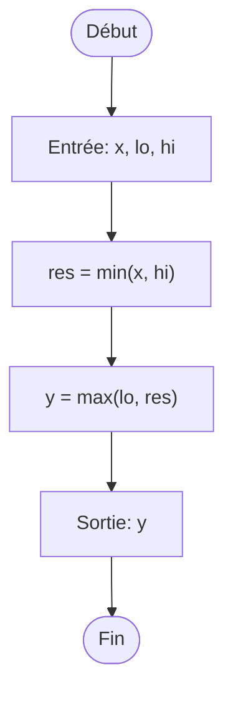

## overlaps(a, b)
**Fonction utilitaire** : Vérifie si deux intervalles de temps se chevauchent.
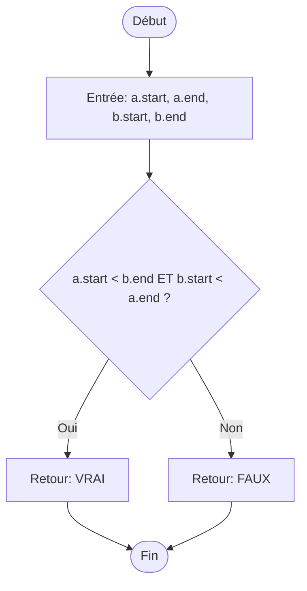

## add_busy(mapBusy, key, interval)
**Fonction utilitaire** : Ajoute un intervalle de temps occupé à la liste des créneaux indisponibles d'une entité (entreprise ou étudiant). Maintient la liste triée et fusionne les intervalles qui se chevauchent.
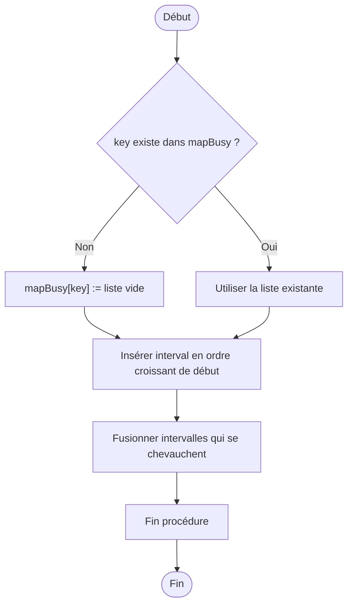

## next_free_within(fenêtre, durée, occupés)
**Fonction de planification** : Trouve le premier créneau libre de la durée souhaitée dans une fenêtre de temps, en évitant les créneaux déjà occupés.
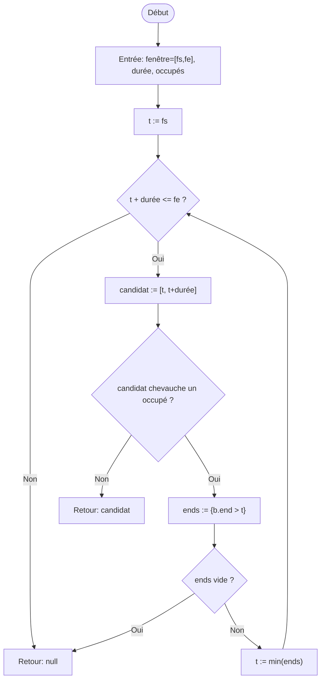

## split_half_days(fenêtre)
**Fonction utilitaire** : Divise une fenêtre de temps en deux demi-journées (AM et PM) en respectant la pause déjeuner obligatoire de 12h30 à 13h30.
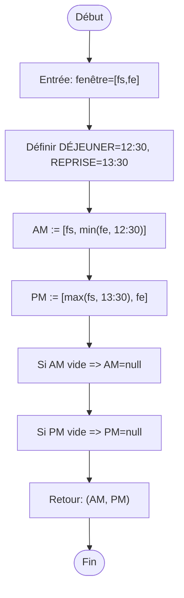

## minutes(fenêtre)
**Fonction utilitaire** : Calcule la durée en minutes d'une fenêtre de temps donnée.
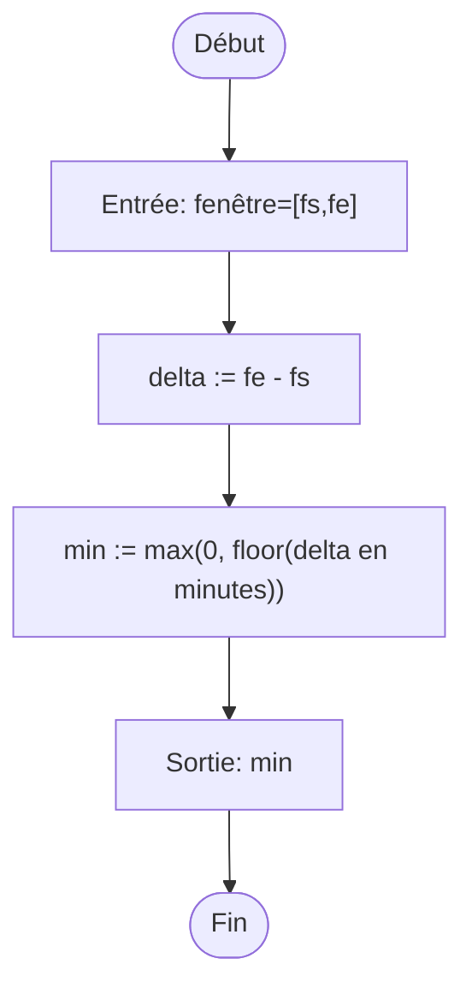

## compute_duration(dispoTotale, demande)
**Fonction de calcul** : Détermine la durée optimale des entretiens (entre 10 et 15 minutes) en fonction du temps disponible et du nombre de demandes.
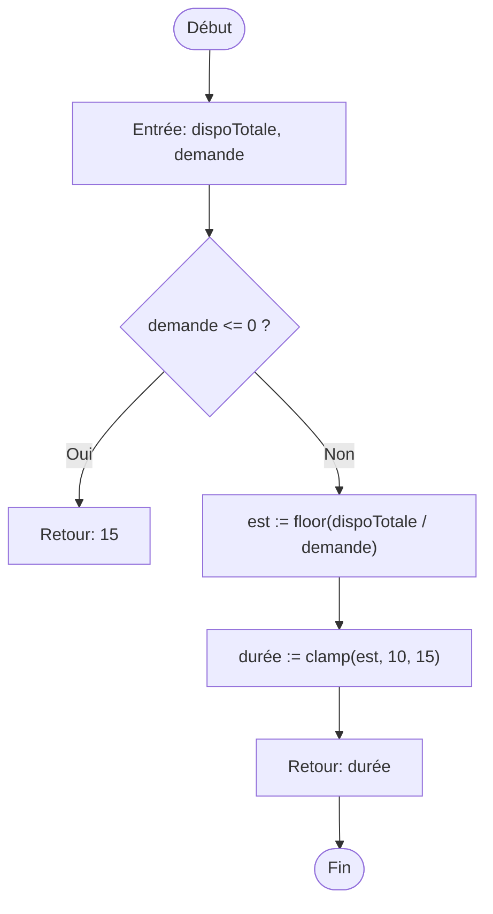

## insert_company_breaks(slots demi-journée, fenêtres, max=2, pause=10)
**Fonction de planification** : Insère automatiquement des pauses entreprise (max 2 par demi-journée, 10 min chacune) dans les créneaux disponibles en évitant les conflits avec les entretiens.
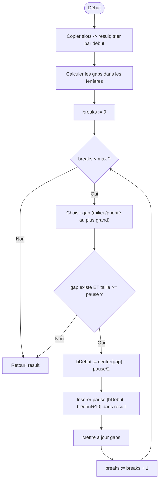

## Charger_Donnees(FORUM_ID)
**Fonction d'initialisation** : Charge toutes les données nécessaires depuis la base (forum, entreprises, disponibilités, demandes d'étudiants) et les structure pour la planification.
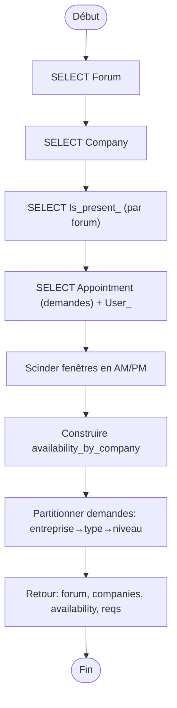

## Calculer_Durees(companies, availability, reqs)
**Fonction de calcul** : Calcule la durée optimale des entretiens (10-15 min) pour chaque entreprise selon le temps disponible et le nombre de demandes étudiants.
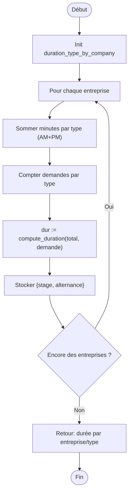

## Placer_RendezVous(companies, availability, reqs, durations)
**Fonction principale de planification** : Place les rendez-vous en respectant l'ordre stage→alternance, les niveaux croissants, les disponibilités des entreprises et évite les conflits d'horaires.
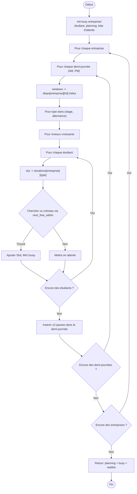

## Compacter_Attente_Etudiants(planning, busy entreprises/étudiants, availability)
**Fonction d'optimisation** : Réduit les temps d'attente des étudiants en regroupant leurs entretiens et en évitant les grands trous dans leur emploi du temps.
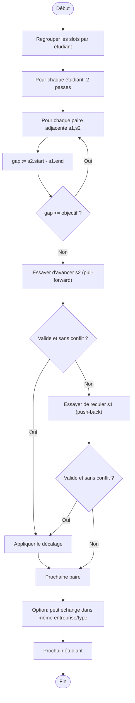

## Ecrire_En_Base(FORUM_ID, planning, liste d'attente)
**Fonction de persistance** : Écrit les rendez-vous planifiés et les pauses dans la base de données et marque les demandes non satisfaites en liste d'attente.
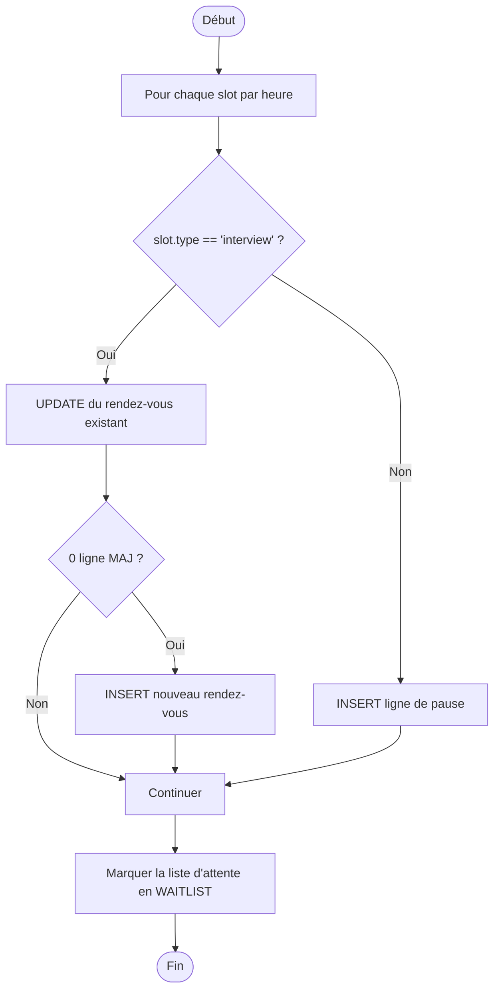

## Planifier_FAMES(FORUM_ID)
**Fonction principale orchestratrice** : Coordonne toutes les étapes de la planification automatique des emplois du temps FAMES en appelant séquentiellement les autres fonctions.
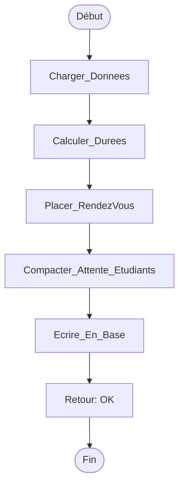

